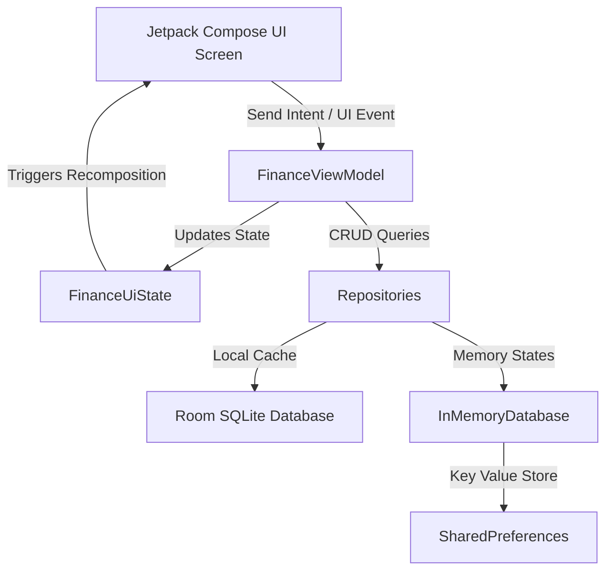

# VibeFinance 📊✨

VibeFinance is a modern, high-fidelity personal finance and daily budgeting Android application. Built using Jetpack Compose and Kotlin, it delivers a state-of-the-art visual experience with interactive animations, custom card layouts, and local data persistence, directly inspired by premium financial tools like Buckwheat.

---

## 🚀 Features

### 📅 Daily Budgeting & Heatmap
- **Budget setup**: When no budget exists, Daily → Set Budget opens the new-period form directly and returns to Daily after saving. Existing budgets open the budget editor.
- **Whole Budget Card**: Visualizes starting budgets with an elegant range indicator chip showing exact dates and days elapsed.
- **Spent & Remaining Wavy Bento Cell**: A fluid wave progress cell representing your remaining budget, dynamically adjusting wave frequency and amplitude. Tapping the cell toggles between "Remaining" and "Spent".
- **Days Left Bento Cell**: Displays a clean, concentric circular progress ring representing elapsed days of the active budget period.
- **Minimum & Maximum Spent Cards**: Showcases lowest and highest expenses with embedded Bezier spends curve animations and node markers.
- **Period Spends Heatmap Calendar**: Color-codes daily expenditures based on budget utilization, featuring radial glow backdrops ("spread") and overflow layout sizing for overspent days.

### 💳 Assets & Cards Manager
- **Room to Type**: Add/Edit Asset and Card sheets smoothly hide the preview while the keyboard is open and restore it when typing finishes, without changing the draft.
- **Interactive Credit Utilization**: Live progress tracking of credit limits, outstanding balances, and available credit grids.
- **Transparent Default Style**: Renders cards with a clean, fully transparent glass-like backdrop by default, adapting text colors dynamically for optimal readability in both dark and light modes.
- **Custom Card Themes**: Enables customizing cards with vibrant gradients (e.g. Sunset Glow, Ocean Breeze, Emerald Forest) and background patterns (e.g. Cyber Grid).

### 💰 Persistent Cashback Rates
- **Account-level Custom Rates**: Allows setting custom cashback return rates (%) for specific categories (Food, Transport, Shopping, Utilities, Other) directly inside each account's edit dialog.
- **Automated Calculation & Triage**: Maps categories (such as "Food & Drink" or "Groceries") via keyword matching to calculate exact cashback amounts.
- **History Tracker**: Displays green indicators showing calculated cashback directly on individual transaction line items.
- **Summary Tracker**: Aggregates and displays total lifetime cashback earned under the asset card.
- **Persistent Storage**: Utilizes local `SharedPreferences` to persist configured rates across restarts and system upgrades.

### Privacy and History Search
- Optional local app lock uses Android biometrics or the device PIN/password. A secure device screen lock must be configured first. App-lock protection also hides screenshots and the Recents preview.
- The toolbar eye button and Settings → Data & privacy → Hide amounts mask displayed monetary values. These controls are optional and default off.
- Toggle the search icon beside Category Analytics to reveal a pill-shaped search bar below the page headings and above the budget-period card. It slides down to open and up to close; the filled icon indicates it is open. The bar’s filter button opens combined filters. History supports text search plus combined account, category, transaction type, inclusive date, and amount-range filters. CSV export follows the filtered records.
- Settings → Customization offers Full, Reduced, and Minimal motion and a blur-intensity slider. These are app settings and do not change device scaling or Android animation settings.
- Color scheme → Palette style selects Tonal spot, Vibrant, Expressive, Neutral, Monochrome or Fidelity. Select a variant and use the pencil to edit its seed color with hex/RGB controls and a live tonal preview. Scroll the variants to the + button to save a reusable Custom variant. Cancel discards edits; saved styles and colors survive restart and full-app backup/restore.
- New preferences are included in full-app backups. Successful app-lock authentication requires configured device credentials; passwords and unlocked sessions are never saved in backups.

### ⚡ Smooth Transitions
- Settings uses compact [ImageToolbox-inspired](https://github.com/T8RIN/ImageToolbox) cards: 10dp side margins, 6dp gaps, 72dp minimum headers and 40dp icon badges. Groups initially appear collapsed beneath a simple pinned toolbar; expanded controls retain rounded press feedback and scroll blur. Colors follow the selected light/dark theme.
- The Settings drawer has 28dp rounding on its free left edge and square corners flush against the right bezel, with its toolbar surface continuing behind the status bar. Native Material drawer insets keep controls clear of status icons and display cutouts. It prefers a 280–360dp width and reserves at least 56dp of touchable scrim; windows narrower than 336dp use a smaller drawer to preserve that margin.
- Settings opens from the right beside the toolbar Settings icon in a Material 3 navigation drawer with a 320 ms emphasized-decelerate slide (`0.05, 0.7, 0.1, 1`). Swipe right, tap outside, use Back, or press Close to dismiss it. Existing settings cards and scroll blur stay available; focused budget configuration and nested pickers retain their modal windows. Page and settings content keep their normal reading direction.
- Native bottom-sheet slides and scrims use a shared 320 ms ease-in/ease-out curve. Reduced/Minimal motion and Android animation preferences still apply, and animations inside each sheet keep their existing behavior.
- Replaced bouncy spring animations with high-performance ease-in-out page transitions (`tween(350)`), making tab switching feel stable, fluid, and robust.

---

## 🏗️ Architecture

The app is built on a clean **Model-View-ViewModel (MVVM)** architecture with Unidirectional Data Flow (UDF):



### Key Components:
- **`MainActivity.kt`**: App entry point, responsible for requesting runtime notifications and initializing the database connection.
- **`FinanceViewModel.kt`**: Coordinates state across all navigation tabs, executing operations via repository modules.
- **`InMemoryDatabase.kt`**: Handles state caching, category spending limits, and persistent cashback rule tables.
- **`AccountsScreen.kt`**: Layout rules and interactive card canvas drawings for the Assets & Cards section.
- **`HomeScreen.kt`**: Manages the main daily budget dashboard and calendar heatmap grid views.
- **`HistoryScreen.kt`**: Displays transactional breakdowns and dynamic cashback labels.

---

## 🛠️ Tech Stack

- **UI Framework**: [Jetpack Compose](https://developer.android.com/compose) (Declarative Kotlin UI)
- **Database**: [Room](https://developer.android.com/training/data-storage/room) (SQLite ORM)
- **Background Jobs**: [WorkManager](https://developer.android.com/topic/libraries/architecture/workmanager) (Daily credit card deadline checks)
- **Local Settings**: [SharedPreferences](https://developer.android.com/reference/android/content/SharedPreferences) (Cashback rules and rates)
- **Architecture**: Kotlin Coroutines, Kotlin Flows, Android Arch Components

---

## 📥 Getting Started

### 📋 Prerequisites
- Android Studio Ladybug (or newer)
- Android SDK 34+
- Java JDK 17

### 🛠️ Build & Installation
Build the debug APK using the Gradle wrapper:
```bash
./gradlew assembleDebug
```

Install it on a connected emulator or physical device:
```bash
adb install -r app/build/outputs/apk/debug/app-debug.apk
```

### 🧪 Run Unit Tests
```bash
./gradlew testDebugUnitTest
```

---

## 🔍 Knowledge Graph (`graphify`)

We use **Graphify** to maintain a persistent knowledge graph of the codebase for navigation and dependency tracking.

### Update the Graph
If you modify code files, keep the graph current with AST-only extraction (free, no API cost):
```bash
graphify update .
```

### Outputs
All outputs are located under `graphify-out/`:
- `graph.html`: Interactive graph visualization.
- `GRAPH_REPORT.md`: Audit report highlighting God Nodes and Surprising Connections.
- `graph.json`: Raw node and edge data.
